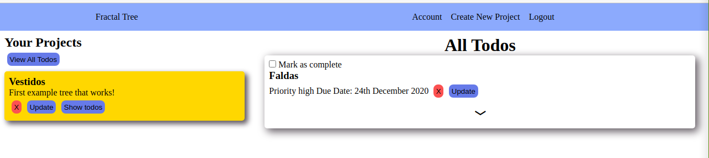

#	Project: To-Do List

### What we built

> A project management website where a user can create projects, include ToDo lists, and also mark completed projects.

> In this project we used firebase (an online back-end services) to create users and save data specific to each user in the database.

### Project screenshot




### 📝 Setup

 - Open a terminal
 
 - Clone this code: 
        ```
        git clone git@github.com:jurgen1c/project-tree.git
        ```

- Run the command ```npm install``` from root directory to install the app dependencies.

- Run the command ```npx webpack``` to bundle up the files.


### Build With

-	HTML
- JavaScript
- Webpack
- Firebase
- SASS  

### Check out the live demo [here](https://deploy-preview-3--hardcore-ride-94bb5a.netlify.app/)     

## 👤 Authors


👤 **Jurgen Clausen Gutierrez**

- Github: [@jurgen1c](https://github.com/jurgen1c)
- LinkedIn: [jurgen-clausen](https://www.linkedin.com/in/jurgen-clausen-2740061a9/)


👤 **Sunday Uche Ezeilo**

- Github: [@sundayezeilo](https://github.com/ezeilo-su)
- Twitter: [@SundayEzeilo](https://twitter.com/SundayEzeilo)
- Linkedin: [Sunday Ezeilo](https://www.linkedin.com/in/sunday-ezeilo-a6a67664/)


## 🤝 Contributing

Contributions, issues and feature requests are welcome!

Feel free to check the [issues page](issues/).

## Show your support

Give a ⭐️ if you like this project!

## Acknowledgments

- Microverse
- etc

## 📝 License

This project is [MIT](lic.url) licensed.